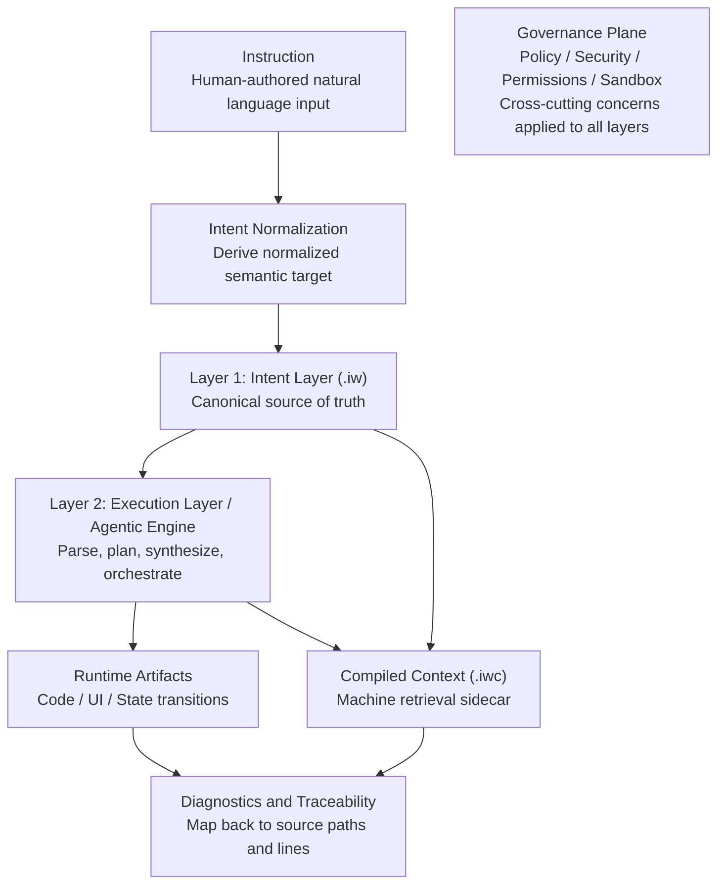

# InstructWare Protocol (IWP) 核心规范 v1.0

**状态（Status）:** Draft (Pre-Launch)  
**作者（Author）:** The DawnChat Core Team  
**许可（License）:** Apache-2.0

本协议规范文本默认遵循仓库级 Apache-2.0 许可，除非另有明确覆盖说明。

> **规范关键字（Normative language）:** 本文档中的 **MUST**、**MUST NOT**、**REQUIRED**、**SHALL**、**SHALL NOT**、**SHOULD**、**SHOULD NOT**、**RECOMMENDED**、**MAY**、**OPTIONAL**，仅在全大写出现时，按 [RFC 2119](https://datatracker.ietf.org/doc/html/rfc2119) 与 [RFC 8174](https://datatracker.ietf.org/doc/html/rfc8174) 解释。

---

## 1. 摘要

InstructWare Protocol（IWP）定义了一套面向“自然语言优先软件”的包模型与编译契约。

IWP 将 Markdown 文档作为规范化意图层（intent layer），同时要求输出机器可验证的编译产物、诊断信息与可追溯能力。该协议用于在人类编写意图与 agent 驱动执行之间实现关注点分离、稳定演进和运行治理护栏。

---

## 2. 适用范围与非目标

IWP 规定：
- 源码包结构（`.iw` bundle）；
- page-first 意图编写方式，以及通过 `@iwp` 注解实现的可选语义类型标注；
- 运行时声明边界（`manifest.yaml`）；
- 面向工具链与 Agent 工作流的编译上下文伴生产物（`.iwc v1`）；
- 意图节点与可执行产物之间的实现可追溯契约。

IWP 不规定：
- 唯一必选的意图编写自然语言；
- 唯一必选的实现编程语言；
- 唯一必选的 UI 框架或后端架构；
- 指定单一 LLM 厂商或模型族；
- 统一的应用层业务语义建模策略。

---

## 3. 一致性要求（Conformance）

实现仅在满足以下要求时，方可宣称 **IWP v1 compliant**：

1. **MUST** 解析并校验第 5 章定义的 `.iw` 包结构。
2. **MUST** 支持第 6 章的 page 编写模型与 `@iwp` 注解语义，包括按剖面定义的校验规则。
3. **MUST** 支持第 7 章定义的 `manifest.yaml` 语义。
4. **MUST** 按第 9 章定义生成 `.iwc v1` 产物。
5. **MUST** 将诊断定位到源 `.iw` 文件路径和行区间。
6. **MUST** 拒绝在意图 Markdown 中直接执行的嵌入式代码（见第 8.3 节）。
7. **MUST** 满足第 9.1 节的实现可追溯要求，以及第 10.1 节按剖面生效的漂移控制要求。

实现 **MAY** 提供扩展剖面（例如企业拓扑），但不得破坏基线一致性。

### 3.1 一致性边界：核心与可选剖面

IWP 采用分层一致性模型，以降低基线采纳门槛：

- **核心（必选）:** 第 5、6、7、8.1-8.3、9、9.1、10、10.1、11、12 章。
- **可选剖面：** 命名扩展集合（例如企业拓扑或 agentic runtime 行为）。
- 可选剖面 **MUST NOT** 放宽核心要求。
- 实现 **MUST** 在 CI 与发布门禁中声明启用的可选剖面。

---

## 4. 术语定义（Definitions）

- **Instruction（指令）:** 归一化之前的人类自然语言输入。
- **Intent Layer（意图层）:** `.iw` 中由人编写的 Markdown，用于声明期望行为与约束。
- **Intent（意图）:** 从一条或多条指令归一化得到、供引擎规划与执行使用的目标语义表示。
- **Page（核心剖面）:** 人类编写的意图文档，通常对应 `pages/` 下的一个文件。
- **Feature Unit（功能单元）:** 在当前剖面下最小可独立追踪的产品能力单元；在核心剖面中，page 是默认功能单元。
- **Execution Layer（执行层）:** 在策略控制下将意图编译为可执行产物的运行时工具链层。
- **Agentic Engine（智体引擎）:** 承担 parsing、planning、synthesis 与 orchestration 的实现组件。
- **Bundle（执行束）:** 以 `.iw` 为后缀的目录，包含全部源意图资产。
- **Compiled Context（`.iwc`）:** 从源 Markdown 生成、面向索引、lint 与 agent 检索的机器侧伴生产物。
- **Capability Plugin（能力插件）:** 在 `manifest.yaml` 的 `requires` 中声明的命名运行时能力。
- **Source of Truth（SSOT）:** 在 IWP 中指源 `.iw` 意图与策略文档，而非生成产物。
- **Deterministic Boundary（确定性边界）:** 在校验与产物检查层可稳定复现的结果（例如 schema 校验、source hash 检查、node 映射）；不等同于模型 token 生成过程本身的确定性。
- **Trace Link（追踪链接）:** 意图节点与一个或多个实现锚点之间可机器校验的映射（例如代码符号、测试用例或生成产物）。
- **Intent Drift（意图漂移）:** 运行时行为或实现产物不再忠实反映当前源意图文档状态的情形。

### 4.1 概念分层模型（非规范性）

下图为非规范性说明，用于帮助理解 IWP 分层心智模型：



注：策略与安全边界是跨层治理关注点，因此用单一治理平面表达，而不绘制多条约束连线。

---

## 5. 包结构与目录拓扑

IWP 源码包根目录 **MUST** 使用 `.iw` 后缀。

基线拓扑采用 page-first，强调人类可读与可维护。  
在核心剖面下，实现 **MUST NOT** 要求最终用户采用固定的 `views/logic/models/state` 目录拆分。

推荐基线拓扑：

```text
AppName.iw/
├── manifest.yaml
├── README.md
├── system.md
├── architecture.md          # optional, advanced
├── dependency.md            # optional, advanced
├── styles/                  # optional
├── pages/
│   ├── home.md
│   ├── settings.md
│   └── billing.md
├── assets/                  # optional
└── prompts/                 # optional
    └── extract_invoice.md
```

`dependency.md` 为可选治理资产，适用于需要显式依赖约束的团队。

编写建议（核心剖面）：

- page **SHOULD** 从产品目标或用户流程视角组织内容。
- page **SHOULD** 优先保证人类可读性，而非实现分类学。
- 在核心剖面下，page **SHOULD** 作为默认功能单元。
- 作者 **MAY** 使用 `@iwp` 标注关键节点。
- 进阶作者在需要更严格可追溯或路由时，**MAY** 添加可选参数（如 `type`、`kind`、`file`、`section`）。
- 对未标注节点，当对应可选能力在当前剖面或策略中启用时，实现运行时 **MAY** 执行语义分类。

多目标说明：

- 执行束 **MAY** 同时声明多个运行目标（例如 `web`、`desktop`、`android`、`ios`、`backend`）。
- 在多目标项目中，实现 **SHOULD** 采用“共享优先 + 目标覆盖”组织方式，以减少重复意图内容。

推荐覆盖拓扑（可选）：

```text
AppName.iw/
├── pages/
│   ├── shared/
│   ├── web/
│   ├── android/
│   └── ios/
├── prompts/
│   ├── shared/
│   └── mobile/
└── assets/
    ├── shared/
    └── web/
```

---

## 6. 意图层规范

### 6.1 Page-First 意图文档

在核心剖面中，`pages/**/*.md` 是主要意图编写表面。  
在该剖面下，每个 page 都作为可追溯与验证的默认功能单元。

每个 page **SHOULD** 以自然语言描述一个连贯的、用户可感知的功能、流程或业务目标。  
该模型有意保持“以人为中心”：作者可从产品意图出发，再逐步细化结构。

### 6.2 `@iwp` 注解语法

实现 **MUST** 支持源 Markdown 中的节点级 `@iwp` 注解。

最小形式：

- `@iwp`
- `@no-iwp`

可选参数形式（校验强度由剖面定义）：

- `@iwp(type=<semantic_type>)`
- `@iwp(kind=<file_type_id.section_key>)`
- `@iwp(file=<file_type_id>,section=<section_key>)`

当同一节点命中多种形式时，实现 **MUST** 应用确定性的优先级规则，并通过诊断报告冲突。

### 6.3 可选的运行时语义推断

对于未显式声明 `type` 或 `kind` 的节点，实现 **MAY** 作为可选能力在运行时推断语义类别。

若启用，推断类别：

- **MUST** 可机器追溯到源节点行区间；
- **MUST NOT** 静默修改源 Markdown；
- **SHOULD** 能在诊断或元数据中与显式注解类别区分开。

### 6.4 典型 Page 示例（规范性示例）

以下示例在语法上具规范约束，对业务内容仅作说明：

```markdown
# Billing Overview

This page explains how users review invoices, pay outstanding balances, and update payment preferences.
Failed payments can be retried up to three times. @iwp(type=policy.rule)

## Primary Actions @iwp
- Review latest invoice details.
- Download invoice PDF.
- Open payment method settings.

## Payment Risk Checks @iwp(type=logic.validation)
- Block payment if account is suspended.
- Require re-authentication for high-value invoices.

## Data Dependencies @iwp(file=models,section=invoice)
- Invoice summary
- Payment status
- Tax breakdown

## Internal Notes @no-iwp
Draft copy ideas for future onboarding.
```

### 6.5 剖面特定的结构映射

实现 **MAY** 根据当前剖面策略，将 page 节点映射到内部架构类别（例如 `views`、`logic`、`models`、`state`）。

除非某可选严格剖面有明确要求，此类映射 **MUST NOT** 强迫基线作者重构源 page 结构。

---

## 7. 清单与环境声明（`manifest.yaml`）

`manifest.yaml` 用于声明运行时元数据、能力权限与目标环境。

要求如下：
- `requires` **MUST** 声明能力级插件标识，不得绑定具体第三方包名称。
- `permissions` **MUST** 显式声明；未声明时按默认拒绝处理。
- `targets` **MAY** 声明一个或多个运行目标。
- 当声明多个目标时，实现 **MUST** 文档化目标解析优先级（例如 `shared -> <target>` 覆盖）。
- 对未知顶层键，实现 **MUST** 按已选剖面模式执行校验（严格/宽松模式由实现定义，但必须文档化）。

示例：

```yaml
version: 1.0.0
name: FinanceTracker
description: Minimalist personal expense tracker

targets:
  - desktop
  - mobile

permissions:
  - fs:write
  - network:none

requires:
  - plugin:sqlite_local
```

---

## 8. 编译与运行模型

### 8.1 双层模型

IWP 兼容系统 **MUST** 具备：

1. **Intent Layer（意图层）:** 以源 `.iw` 执行束作为规范化意图 SSOT。
2. **Execution Layer（执行层）:** 由 Agentic Engine 解析意图并生成目标平台可执行产物。

### 8.2 执行时机

编译 **MAY** 发生于：
- 运行时（dynamic）；
- 预构建期（AOT）；
- 或混合模式。

实现 **MUST** 明确说明采用的时机模型及校验门位置。

### 8.3 源内容嵌入约束

IWP 意图 Markdown **MUST NOT** 直接内嵌用于运行时执行的通用编程语言代码。  
实现 **MAY** 允许文档示例代码块，但 **MUST** 将其视为不可执行内容。

### 8.4 Agentic Runtime 闭环（可选剖面）

实现 **MAY** 支持 agentic runtime 闭环，以实现受控自修改与迭代交付（例如 `propose -> diff -> verify -> approve -> apply -> monitor -> rollback`）。

当启用该可选剖面时：

- 所有影响运行时的编辑 **MUST** 保持可追溯到源意图节点；
- 第 9.1 与 10.1 章中的验证与漂移控制门禁 **MUST** 仍然生效；
- 高风险动作 **MUST** 按第 12 章保留明确审批检查点。

### 8.5 语言中立与支持披露

为在保持意图契约稳定的同时保障实现多样性：

- 实现 **MUST NOT** 要求仅允许单一自然语言编写意图，或仅允许单一实现语言承载执行层。
- 实现 **MUST** 在所有已声明支持的意图语言与运行时语言目标上，执行一致的可追溯与漂移控制门禁（第 9.1 与第 10.1 章）。
- 实现 **SHOULD** 发布意图语言与运行时语言目标支持矩阵，并给出明确成熟度标签（例如 `stable`、`beta`、`experimental`）。
- 当不同已声明目标间的行为等价性尚未保证时，实现 **MUST** 文档化已知一致性边界与限制。

---

## 9. 编译上下文伴生产物（`.iwc v1`）

为同时保留源文档可读性与机器检索能力，工具链 **MUST** 生成双格式 `.iwc` 伴生产物：

- `.iwp/compiled/json/**/*.iwc.json`
- `.iwp/compiled/md/**/*.iwc.md`

规范要求：

- 源 `.iw` 文件仍是规范化意图 SSOT。
- `.iwc.json` **MUST** 为有效 UTF-8 JSON，且 **SHOULD** 使用美化格式。
- `.iwc.md` **MUST** 保留源 Markdown 顺序。
- 诊断结果 **MUST** 映射回源 `.iw` 文件路径与行区间。
- 每份编译文档 **MUST** 包含 `source_hash`。
- 本规范支持的格式版本为 `version: 1`。

推荐输出拓扑：

```text
.iwp/
└── compiled/
    ├── json/
    │   ├── pages/home.iwc.json
    │   └── pages/billing.iwc.json
    └── md/
        ├── pages/home.iwc.md
        └── pages/billing.iwc.md
```

`.iwc v1` 结构示例：

```json
{
  "artifact": "iwc",
  "version": 1,
  "schema_version": "2.0.0",
  "generated_at": "2026-03-17T07:23:26.521181+00:00",
  "source_path": "pages/home.md",
  "source_hash": "sha256:...",
  "dict": {
    "kinds": ["pages.document", "logic.validation"],
    "titles": ["page_home", "page_home.interaction_hooks"],
    "sections": ["document", "interaction_hooks"],
    "file_types": ["pages"]
  },
  "nodes": [
    ["n.a327", "Read Manifesto", 1, 1, 1, 0, 1, 21, 24, "- \"Read Manifesto\" delegates ..."]
  ]
}
```

节点 tuple 顺序固定：

1. `node_id`
2. `anchor_text`
3. `kind_idx`
4. `title_idx`
5. `section_idx`
6. `file_type_idx`
7. `is_critical`（`0` 或 `1`）
8. `source_line_start`
9. `source_line_end`
10. `block_text`（必填）

### 9.1 实现可追溯契约

为防止意图漂移，IWP 实现 **MUST** 在意图节点与可执行产物之间维持双向可追溯性。

最低要求：

1. 实现 **MUST** 定义并文档化链接策略，将节点类别（例如 kind、关键性或 section）映射到所需链接覆盖行为。
2. 在受治理工作流中引入的运行时影响变更，**MUST** 按当前策略/剖面对受影响节点满足链接要求。
3. 当当前策略/剖面要求时，每个运行时影响 `node_id` **MUST** 至少解析到一个实现锚点（代码符号、测试用例或生成产物）。
4. 追踪链接 **MUST** 在本地与 CI 验证流中可机器校验。
5. 缺失或陈旧追踪链接 **MUST** 输出诊断，严重级别由当前策略/剖面决定；严格剖面 **MUST** 对关键链接缺失或陈旧直接失败。

实现说明（非规范性）：追踪链接可表示为行内注解、外部映射文件或等价结构，只要满足一致性要求即可。

## 10. 校验与诊断模型

IWP 实现 **MUST** 至少暴露四层校验：

1. **结构校验：** 包拓扑与必需文件。
2. **语义校验：** 注解合法性、章节语义与按剖面定义的边界规则。
3. **链接校验：** 源节点引用与可追溯一致性。
4. **产物校验：** 编译新鲜度与 schema 一致性。

诊断输出 **MUST** 具备机器可读性，并包含：
- code，
- severity，
- source path，
- line range，
- remediation hint（如可提供）。

### 10.1 意图-实现漂移控制与合并门禁

面向团队或 CI 的 IWP 实现 **MUST** 定义并文档化用于漂移控制的合并门禁（即防止意图文档与可执行行为失配）。

必需门禁：

1. 编译产物新鲜度（`source_hash` 对齐）；
2. 追踪链接完整性（关键链接不得缺失或陈旧）；
3. 意图覆盖阈值（由实现定义并文档化，允许按节点类别与当前剖面差异化）；
4. 受影响节点的回归检查。

在严格剖面下，任一必需门禁失败 **MUST** 阻断合并或发布。

### 10.2 最小化验证证据

每次验证运行中，实现 **MUST** 产出可机器读取的证据，并可在本地或 CI 持久化：

1. 各校验层的门禁结果摘要（`pass`/`fail`）；
2. 带稳定标识符的诊断列表；
3. 受影响节点的可追踪性检查结果；
4. 与 `source_hash` 绑定的产物新鲜度结果。

---

## 11. 版本与兼容策略

- 协议版本由本规范声明（`IWP v1.0`）。
- `.iwc` 产物版本独立管理（本规范为 `v1`）。
- 对不支持的主版本，实现 **MUST** 明确拒绝。
- 对未知且非关键字段，实现仅可在显式文档化的宽松模式下 **SHOULD** 选择忽略。
- 破坏性变更 **MUST** 升主版本并提供迁移指引。

### 11.1 开放规范与实现多样性（非规范性）

IWP 采用开放标准生态中的常见模式：

- 规范定义互操作与一致性契约；
- 实现在易用性、性能与生态集成上竞争；
- 协议成立不依赖单一参考实现。

IWP 与许多传统软件接口规范的关键差异在于：它将“意图到执行”的可追溯性与漂移控制提升为协议级要求，而非可选工具约定。

### 11.2 一致性等级与兼容矩阵

为降低采纳摩擦并保持互操作性，实现 **SHOULD** 发布一致性等级：

- **L1 Core Structure：** 包拓扑、意图边界、manifest 语义与 `.iwc v1` 输出。
- **L2 Core Governance：** 诊断映射、追踪契约与漂移控制门禁。
- **L3 Optional Runtime：** 一个或多个可选剖面（例如 agentic runtime 闭环或企业剖面）。

实现 **SHOULD** 发布兼容矩阵，至少包含：

- 支持的 IWP 协议主/次版本；
- 支持的 `.iwc` 主版本；
- 宣称的一致性最高等级；
- 已启用的可选剖面名称。

### 11.3 Draft 发布策略（Pre-Launch）

当本规范处于 Draft（Pre-Launch）阶段时：

- 草案修订之间 **MAY** 存在小幅结构或措辞调整；
- 所有规范性行为变更 **MUST** 在发布说明中记录；
- 破坏性语义更新 **SHOULD** 提前公告并提供明确迁移指引；
- 草案反馈问题 **SHOULD** 提交至 `https://github.com/InstructWare/instructware.org/issues/new/choose`。

---

## 12. 安全考虑（Security Considerations）

IWP 实现 **MUST** 至少覆盖以下风险面：

- 试图篡改执行策略的 prompt injection；
- 通过插件声明进行未授权能力提升；
- 编译伴生产物陈旧或被篡改；
- 动态代码加载中的不安全边界绕过。

最低要求：

1. 权限与能力默认拒绝，除非显式授权。
2. 插件调用在运行时执行策略校验。
3. 通过 `source_hash` 校验编译产物新鲜度。
4. 关键动作通过结构化执行日志实现可审计。
5. 恢复机制支持回滚或安全失败（safe-fail）。
6. 记录能力调用的指令来源与策略决策以支持审计。
7. 高风险动作（例如特权写入或外部副作用）要求显式审批检查点。

---

## 13. 企业级剖面（可选）

面向多领域大型系统，实现 **MAY** 从基线 page-first 编写方式演进到 feature-first 剖面。  
该剖面在保留 page-first 编写方式的同时，为规模化、权属与 CI 治理提供更强结构边界。  
在多目标项目中，它同样 **MAY** 按需采用共享资产与目标覆盖结构。

参考拓扑：

```text
SmartCRM.iw/
├── manifest.yaml
├── README.md
├── system.md
├── architecture.md
├── dependency.md
├── assets/
├── locales/
├── styles/
├── shared/
│   ├── views/components/
│   ├── logic/middleware/
│   ├── state/
│   └── prompts/
├── features/
│   ├── auth/
│   │   ├── views/pages/login.md
│   │   ├── views/components/login_form.md
│   │   ├── logic/login_verify.md
│   │   ├── state/session.md
│   │   ├── models/user.md
│   │   └── tests/test_login.md
│   └── crm/
│       ├── views/pages/deal_list.md
│       ├── views/components/deal_card.md
│       ├── logic/create_deal.md
│       ├── state/deal_runtime.md
│       ├── models/deal.md
│       └── tests/test_kpi.md
└── tests/e2e/
```

采用该剖面时，推荐约束：

- `features/<domain>/` 域边界默认私有（private-by-default）；
- 依赖方向保持单向：`views -> logic -> state/models`；
- 最小化提升到 `shared/`；
- 同时执行领域内与跨领域测试护栏。

过渡说明：

- 在核心剖面下，团队可在 `pages/` 中直接编写，并使用轻量 `@iwp` 注解。
- 在企业剖面下，团队可将超大型 page 渐进拆分到 `features/<domain>/views|logic|models|state`，且无需改变 IWP 的可追溯契约。

---

## 14. 结语

IWP 并不消除软件复杂性；它将复杂性重组为“人类可读的意图层 + 机器可验证的执行产物”。该协议旨在让意图、实现与运行在长期系统演进中持续保持对齐。
