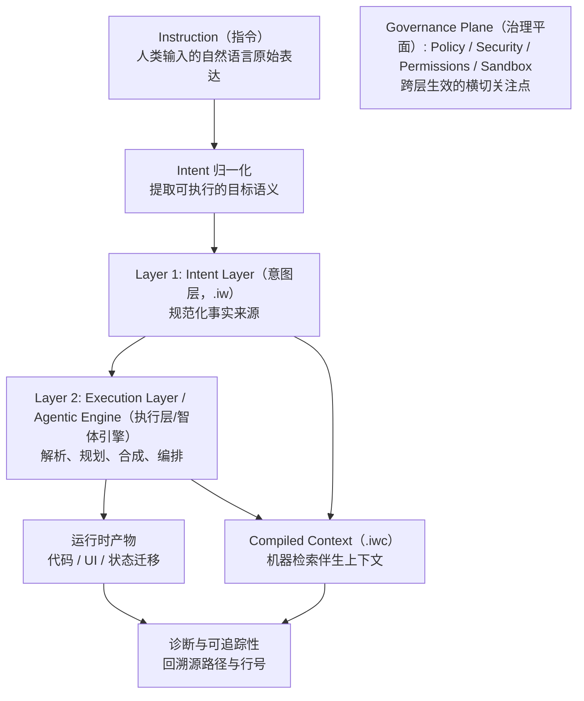

# InstructWare Protocol (IWP) 核心规范 v1.0

**状态（Status）:** Draft (Pre-Launch)  
**作者（Author）:** The DawnChat Core Team  
**许可（License）:** MIT

> **规范关键字（Normative language）:** 本文档中的 **MUST**、**MUST NOT**、**REQUIRED**、**SHALL**、**SHALL NOT**、**SHOULD**、**SHOULD NOT**、**RECOMMENDED**、**MAY**、**OPTIONAL**，仅在全大写出现时，按 [RFC 2119](https://datatracker.ietf.org/doc/html/rfc2119) 与 [RFC 8174](https://datatracker.ietf.org/doc/html/rfc8174) 解释。

---

## 1. 摘要

InstructWare Protocol（IWP）定义了一套面向“自然语言优先软件”的包模型与编译契约。

IWP 以 Markdown 文档作为规范化意图层，同时要求输出机器可验证的编译产物、诊断信息与可追踪映射，以支持关注点分离、长期演进和运行治理。

---

## 2. 适用范围与非目标

IWP 规定：
- 源码包结构（`.iw` bundle）；
- 核心意图文档类别（`views/`、`logic/`、`models/`、`state/`）；
- 运行时声明边界（`manifest.yaml`）；
- 面向工具链与 Agent 流程的编译伴生产物（`.iwc v1`）。

IWP 不规定：
- 唯一必选的 UI 框架或后端架构；
- 指定单一 LLM 厂商或模型族；
- 统一的业务语义建模方法。

---

## 3. 一致性要求（Conformance）

实现仅在满足以下要求时，方可宣称 **IWP v1 compliant**：

1. **MUST** 解析并校验第 5 章定义的 `.iw` 包结构。
2. **MUST** 执行第 6 章定义的 `views/`、`logic/`、`models/`、`state/` 分层边界规则。
3. **MUST** 支持第 7 章定义的 `manifest.yaml` 语义。
4. **MUST** 生成第 9 章定义的 `.iwc v1` 产物。
5. **MUST** 将诊断定位到源 `.iw` 文件路径和行区间。
6. **MUST** 拒绝在意图 Markdown 中直接执行的嵌入式传统代码（见第 8.3 节）。

实现 **MAY** 提供扩展组织剖面（如企业版拓扑），但不得破坏基线一致性。

---

## 4. 术语定义（Definitions）

- **Instruction（指令）:** 人类输入的自然语言原始表达，尚未归一化。
- **Intent Layer（意图层）:** `.iw` 中由人编写的 Markdown 文档，用于声明目标行为与约束。
- **Intent（意图）:** 从一条或多条指令归一化得到、供引擎规划与执行使用的目标语义表示。
- **Execution Layer（执行层）:** 将意图编译为可执行产物并执行策略控制的运行时/工具链层。
- **Agentic Engine（智体引擎）:** 承担解析、规划、合成与编排的实现组件。
- **Bundle（执行束）:** 以 `.iw` 为后缀的目录，包含全部源意图资产。
- **Compiled Context（`.iwc`）:** 从源 Markdown 生成、面向机器检索与诊断的伴生产物。
- **Capability Plugin（能力插件）:** 在 `manifest.yaml` 的 `requires` 中声明的能力标识。
- **SSOT（Single Source of Truth）:** 在 IWP 中指源 `.iw` 意图文档与策略文档，而非生成产物。
- **Deterministic Boundary（确定性边界）:** 指在校验与产物检查层可稳定复现的结果（如 schema 校验、`source_hash` 检查、node 映射），不等同于模型逐 token 生成过程的确定性。

### 4.1 概念分层模型（非规范性）

下图为非规范性说明，用于帮助理解 IWP 的分层心智模型：



注：策略与安全边界属于跨层治理关注点，因此采用单一治理平面表达，而不绘制多条约束连线。

---

## 5. 包结构与目录拓扑

IWP 源码包根目录 **MUST** 使用 `.iw` 后缀。

基线目录拓扑如下：

```text
AppName.iw/
├── manifest.yaml
├── README.md
├── system.md
├── architecture.md          # optional, advanced
├── dependency.md            # optional, advanced
├── styles/                  # optional
├── models/                  # optional, advanced
│   ├── user.md
│   └── expense.md
├── state/                   # optional, advanced
│   ├── ui_prefs.md
│   └── docs_runtime.md
├── views/
│   ├── pages/
│   │   ├── home.md
│   │   └── settings.md
│   └── components/
├── logic/
│   ├── on_add_expense.md
│   └── calculate_tax.md
└── prompts/                 # optional
    └── extract_invoice.md
```

`dependency.md` 为可选治理资产，面向需要显式依赖约束的团队。

---

## 6. 意图层规范

### 6.1 `models/*.md`

`models/` 用于声明持久化实体及约束。实现 **MUST** 将声明映射为目标持久化 schema（如 SQL DDL、文档库 schema）并执行校验。

### 6.2 `views/**/*.md`

`views/` 用于声明界面语义、层级结构与交互钩子。本层文件 **MUST NOT** 直接执行状态变更或持久化副作用。

### 6.3 `logic/*.md`

`logic/` 用于声明事件处理、验证流程、状态迁移与副作用编排。由 UI 交互触发的状态变更 **MUST** 经过逻辑层入口。

### 6.4 `state/*.md`

`state/` 用于声明运行态所有权与不变量。持久化实体 **MUST NOT** 定义在 `state/`，应定义在 `models/`。

### 6.5 分层边界规则

- 允许 `views -> logic`。
- 允许 `logic -> state/models/plugins`。
- `views -> plugins` 直接调用 **MUST NOT** 允许。
- 跨文件引用 **SHOULD** 使用显式路径标识。

---

## 7. 清单与环境声明（`manifest.yaml`）

`manifest.yaml` 用于声明运行时元数据、能力权限与目标环境。

要求如下：
- `requires` **MUST** 声明能力级插件标识，不得绑定具体第三方库名称。
- `permissions` **MUST** 显式声明；未声明时按默认拒绝处理。
- 对未知顶层键，实现在严格/宽松模式下的处理策略可自行定义，但 **MUST** 文档化。

示例：

```yaml
version: 1.0.0
name: FinanceTracker
description: Minimalist personal expense tracker

targets:
  - desktop
  - mobile

permissions:
  - fs:write
  - network:none

requires:
  - plugin:sqlite_local
```

---

## 8. 编译与运行模型

### 8.1 双层模型

IWP 兼容系统 **MUST** 具备：

1. **Intent Layer（意图层）:** 以源 `.iw` 执行束作为规范化意图 SSOT。
2. **Execution Layer（执行层）:** 由 Agentic Engine 解析意图并生成目标平台可执行产物。

### 8.2 编译时机

编译 **MAY** 发生于：
- 运行时（dynamic）；
- 预构建期（AOT）；
- 或混合模式。

实现 **MUST** 明确说明采用的时机模型及校验门位置。

### 8.3 源内容嵌入约束

IWP 意图 Markdown **MUST NOT** 直接内嵌用于运行时执行的通用编程语言代码。  
实现 **MAY** 允许文档示例代码块，但 **MUST** 将其视为不可执行内容。

---

## 9. 编译上下文伴生产物（`.iwc v1`）

为同时保留源文档可读性与机器检索能力，工具链 **MUST** 生成双格式 `.iwc` 伴生产物：

- `.iwp/compiled/json/**/*.iwc.json`
- `.iwp/compiled/md/**/*.iwc.md`

规范要求：

- 源 `.iw` 仍是规范化意图 SSOT。
- `.iwc.json` **MUST** 为有效 UTF-8 JSON，且 **SHOULD** 使用美化格式。
- `.iwc.md` **MUST** 保留源 Markdown 顺序。
- 诊断结果 **MUST** 映射回源 `.iw` 路径与行区间。
- 每份编译文档 **MUST** 包含 `source_hash`。
- 本规范支持的 `.iwc` 格式版本为 `version: 1`。

推荐输出目录：

```text
.iwp/
└── compiled/
    ├── json/
    │   ├── views/pages/home.iwc.json
    │   └── logic/on_add_expense.iwc.json
    └── md/
        ├── views/pages/home.iwc.md
        └── logic/on_add_expense.iwc.md
```

`.iwc v1` 结构示例：

```json
{
  "artifact": "iwc",
  "version": 1,
  "schema_version": "2.0.0",
  "generated_at": "2026-03-17T07:23:26.521181+00:00",
  "source_path": "views/pages/home.md",
  "source_hash": "sha256:...",
  "dict": {
    "kinds": ["views.pages.document", "views.pages.interaction_hooks"],
    "titles": ["page_home", "page_home.interaction_hooks"],
    "sections": ["document", "interaction_hooks"],
    "file_types": ["views.pages"]
  },
  "nodes": [
    ["n.a327", "Read Manifesto", 1, 1, 1, 0, 1, 21, 24, "- \"Read Manifesto\" delegates ..."]
  ]
}
```

节点 tuple 顺序固定：

1. `node_id`
2. `anchor_text`
3. `kind_idx`
4. `title_idx`
5. `section_idx`
6. `file_type_idx`
7. `is_critical`（`0` 或 `1`）
8. `source_line_start`
9. `source_line_end`
10. `block_text`（必填）

## 10. 校验与诊断模型

IWP 实现 **SHOULD** 至少暴露四层校验：

1. **结构校验：** 包结构与必需文件。
2. **语义校验：** 合法章节与分层边界规则。
3. **链接校验：** 源节点引用与追踪一致性。
4. **产物校验：** 编译产物新鲜度与 schema 一致性。

诊断输出 **SHOULD** 具备机器可读性，并包含：
- code，
- severity，
- source path，
- line range，
- remediation hint（如可提供）。

---

## 11. 版本与兼容策略

- 协议版本由本规范声明（`IWP v1.0`）。
- `.iwc` 产物版本独立管理（本规范为 `v1`）。
- 对不支持的主版本，实现 **MUST** 明确拒绝。
- 对未知且非关键字段，仅可在文档化的宽松模式下 **SHOULD** 选择忽略。
- 破坏性变更 **MUST** 升主版本并提供迁移指引。

---

## 12. 安全考虑（Security Considerations）

IWP 实现 **MUST** 至少覆盖以下风险面：

- 试图改变执行策略的 prompt injection；
- 通过插件声明进行能力越权；
- 编译伴生产物陈旧或被篡改；
- 动态代码加载过程中的边界绕过。

最低要求：

1. 权限与能力默认拒绝，除非显式授权。
2. 插件调用在运行时进行策略校验。
3. 通过 `source_hash` 校验编译产物新鲜度。
4. 关键动作具备结构化审计日志。
5. 恢复机制支持回滚或安全失败（safe-fail）。

---

## 13. 企业级剖面（可选）

面向多领域大型系统，实现在不破坏基线结构的前提下 **MAY** 提供 Feature-First 组织剖面。

参考拓扑：

```text
SmartCRM.iw/
├── manifest.yaml
├── README.md
├── system.md
├── architecture.md
├── dependency.md
├── assets/
├── locales/
├── styles/
├── shared/
│   ├── views/components/
│   ├── logic/middleware/
│   ├── state/
│   └── prompts/
├── features/
│   ├── auth/
│   │   ├── views/pages/login.md
│   │   ├── views/components/login_form.md
│   │   ├── logic/login_verify.md
│   │   ├── state/session.md
│   │   ├── models/user.md
│   │   └── tests/test_login.md
│   └── crm/
│       ├── views/pages/deal_list.md
│       ├── views/components/deal_card.md
│       ├── logic/create_deal.md
│       ├── state/deal_runtime.md
│       ├── models/deal.md
│       └── tests/test_kpi.md
└── tests/e2e/
```

采用该剖面时，推荐约束：

- `features/<domain>/` 领域资产默认私有；
- 依赖方向保持单向：`views -> logic -> state/models`；
- `shared/` 最小化提升；
- 同时执行领域内与跨领域测试护栏。

---

## 14. 结语

IWP 并不消除软件复杂性，而是将复杂性重组为“人类可读意图层 + 机器可验证执行产物”的协作模型，以维持意图、实现与运行三者在长期演进中的一致性。