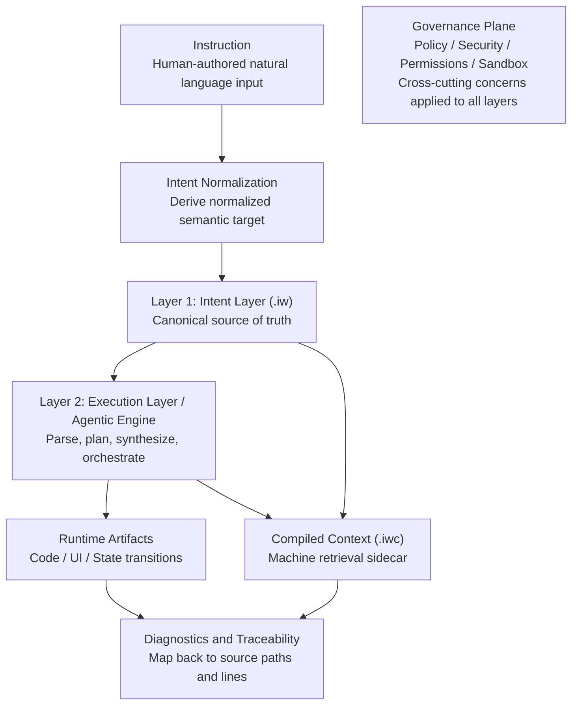

# InstructWare Protocol (IWP) Core Specification v1.0

**Status:** Draft (Pre-Launch)
**Author:** The DawnChat Core Team
**License:** MIT

> **Normative language:** The key words **MUST**, **MUST NOT**, **REQUIRED**, **SHALL**, **SHALL NOT**, **SHOULD**, **SHOULD NOT**, **RECOMMENDED**, **MAY**, and **OPTIONAL** in this document are to be interpreted as described in [RFC 2119](https://datatracker.ietf.org/doc/html/rfc2119) and [RFC 8174](https://datatracker.ietf.org/doc/html/rfc8174), when, and only when, they appear in all capitals.

---

## 1. Abstract

InstructWare Protocol (IWP) defines a package model and compilation contract for natural-language-first software.

IWP treats Markdown documents as the canonical intent layer while requiring machine-verifiable compiled artifacts, diagnostics, and traceability. The protocol enables separation of concerns, stable evolution, and operational guardrails across human-authored intent and agent-driven execution.

---

## 2. Scope and Non-Goals

IWP specifies:
- source package structure (`.iw` bundle),
- core intent document classes (`views/`, `logic/`, `models/`, `state/`),
- runtime declaration boundary (`manifest.yaml`),
- compiled context sidecar (`.iwc v1`) for toolchain and agent workflows,
- implementation traceability contracts between intent nodes and executable artifacts.

IWP does not specify:
- a single mandatory UI framework or backend architecture,
- a specific LLM vendor or model family,
- a universal strategy for application-level business semantics.

---

## 3. Conformance

An implementation is **IWP v1 compliant** only if it satisfies all requirements below:

1. It **MUST** parse and validate `.iw` bundle structure defined in Section 5.
2. It **MUST** enforce boundary rules for `views/`, `logic/`, `models/`, and `state/` in Section 6.
3. It **MUST** support `manifest.yaml` semantics in Section 7.
4. It **MUST** generate `.iwc v1` artifacts exactly as defined in Section 9.
5. It **MUST** report diagnostics against source `.iw` paths and source line ranges.
6. It **MUST** reject executable embedded code in intent markdown (Section 8.3).
7. It **MUST** satisfy implementation traceability requirements in Section 9.1 and profile-appropriate drift-control requirements in Section 10.1.

Implementations **MAY** provide extended profiles (for example, enterprise topology) as long as baseline conformance remains intact.

---

## 4. Definitions

- **Instruction:** Human-authored natural language input before normalization.
- **Intent Layer:** Human-authored Markdown in `.iw` that declares desired behavior and constraints.
- **Intent:** Normalized semantic target derived from one or more instructions and used by the engine for planning and execution.
- **Execution Layer:** The runtime/toolchain that compiles intent into executable artifacts under policy control.
- **Agentic Engine:** The implementation component that performs parse, planning, synthesis, and orchestration.
- **Bundle:** A directory with `.iw` suffix that contains all source intent assets.
- **Compiled Context (`.iwc`):** Machine-oriented sidecar generated from source Markdown for indexing, linting, and agent retrieval.
- **Capability Plugin:** A named runtime capability declared in `manifest.yaml` under `requires`.
- **Source of Truth (SSOT):** In IWP, source `.iw` Markdown for intent and policy documents, not generated artifacts.
- **Deterministic Boundary:** Validation and artifact checks that produce stable outcomes (for example schema validation, source hash checks, node mapping), even if model token generation is probabilistic.
- **Trace Link:** A machine-verifiable mapping between an intent node and one or more implementation anchors (for example code symbols, tests, or generated artifacts).
- **Intent Drift:** The state where runtime behavior or implementation artifacts no longer faithfully represent current source intent documents.

### 4.1 Conceptual Layer Model (Non-Normative)

The following diagram is non-normative and is provided to clarify the mental model of IWP layers:



Note: Policy and security boundaries are cross-cutting governance concerns and therefore are shown as a single governance plane rather than multiple constraint edges.

---

## 5. Package Structure and Topology

An IWP source package **MUST** use `.iw` as the root directory suffix.

Baseline topology:

```text
AppName.iw/
├── manifest.yaml
├── README.md
├── system.md
├── architecture.md          # optional, advanced
├── dependency.md            # optional, advanced
├── styles/                  # optional
├── models/                  # optional, advanced
│   ├── user.md            
│   └── expense.md           
├── state/                   # optional, advanced
│   ├── ui_prefs.md
│   └── docs_runtime.md
├── views/
│   ├── pages/
│   │   ├── home.md
│   │   └── settings.md
│   └── components/
├── logic/
│   ├── on_add_expense.md
│   └── calculate_tax.md
└── prompts/                 # optional
    └── extract_invoice.md
```

`dependency.md` is optional and intended for teams that need explicit dependency governance constraints.

Multi-target note:

- A package **MAY** declare multiple runtime targets (for example `web`, `desktop`, `android`, `ios`, `backend`).
- For multi-target projects, implementations **SHOULD** use a shared-first topology with target overlays to minimize duplicated intent documents.

Recommended overlay topology (optional):

```text
AppName.iw/
├── views/
│   ├── shared/
│   ├── web/
│   ├── android/
│   └── ios/
├── logic/
│   ├── shared/
│   └── backend/
└── state/
    ├── shared/
    └── mobile/
```

---

## 6. Intent Layer Specifications

### 6.1 `models/*.md`

`models/` defines persistent entities and constraints. Implementations **MUST** map declarations to target persistence schemas (for example SQL DDL, document schema) with validation.

### 6.2 `views/**/*.md`

`views/` defines UI semantics, hierarchy, and interaction hooks. Files in this layer **MUST NOT** perform state mutation or persistence side effects directly.

### 6.3 `logic/*.md`

`logic/` defines event handling, validation flow, state transitions, and side effects. Logic handlers **MUST** be the mutation gateway for runtime state updates triggered by UI interaction.

### 6.4 `state/*.md`

`state/` defines runtime state ownership and invariants. Persistent entities **MUST NOT** be declared in `state/`; they belong to `models/`.

### 6.5 Boundary Rules

- `views -> logic` calls are allowed.
- `logic -> state/models/plugins` calls are allowed.
- `views -> plugins` direct invocation **MUST NOT** be allowed.
- Cross-file references **SHOULD** use explicit path-style identifiers.

---

## 7. Manifest and Environment Declaration (`manifest.yaml`)

`manifest.yaml` defines runtime metadata, capability permissions, and target environments.

Requirements:
- `requires` **MUST** declare capability-level plugin identifiers, not concrete third-party package names.
- `permissions` **MUST** be explicit and deny-by-default when omitted.
- `targets` **MAY** declare one or more runtime targets.
- When multiple targets are declared, implementations **MUST** document target resolution precedence (for example `shared -> <target>` override).
- Implementations **MUST** validate unknown top-level keys according to profile mode (strict or permissive mode is implementation-defined but must be documented).

Example:

```yaml
version: 1.0.0
name: FinanceTracker
description: Minimalist personal expense tracker

targets:
  - desktop
  - mobile

permissions:
  - fs:write
  - network:none

requires:
  - plugin:sqlite_local
```

---

## 8. Compilation and Runtime Model

### 8.1 Two-Layer Model

IWP-compliant systems **MUST** implement:

1. **Intent Layer:** Source `.iw` bundle used as the canonical intent SSOT.
2. **Execution Layer:** Agentic Engine that parses intent and emits executable artifacts for target platforms.

### 8.2 Execution Timing

Compilation **MAY** occur:
- at runtime (dynamic),
- ahead-of-time (AOT),
- or in a hybrid model.

The implementation **MUST** document which timing model it uses and where validation gates execute.

### 8.3 Source Embedding Constraint

IWP intent Markdown **MUST NOT** embed executable source code intended for direct runtime execution in general-purpose languages.  
Implementations **MAY** allow fenced examples for documentation, but such blocks **MUST** be treated as non-executable content.

---

## 9. Compiled Context Sidecar (`.iwc v1`)

To preserve source readability while supporting machine retrieval, toolchains **MUST** generate `.iwc` sidecars in dual format:

- `.iwp/compiled/json/**/*.iwc.json`
- `.iwp/compiled/md/**/*.iwc.md`

Normative constraints:

- Source `.iw` files remain canonical intent SSOT.
- `.iwc.json` **MUST** be valid UTF-8 JSON and **SHOULD** be pretty-printed.
- `.iwc.md` **MUST** preserve source markdown order.
- Diagnostics **MUST** map to source `.iw` file paths and line ranges.
- Each compiled document **MUST** include `source_hash`.
- Supported format version for this spec is `version: 1`.

Recommended output topology:

```text
.iwp/
└── compiled/
    ├── json/
    │   ├── views/pages/home.iwc.json
    │   └── logic/on_add_expense.iwc.json
    └── md/
        ├── views/pages/home.iwc.md
        └── logic/on_add_expense.iwc.md
```

`.iwc v1` shape:

```json
{
  "artifact": "iwc",
  "version": 1,
  "schema_version": "2.0.0",
  "generated_at": "2026-03-17T07:23:26.521181+00:00",
  "source_path": "views/pages/home.md",
  "source_hash": "sha256:...",
  "dict": {
    "kinds": ["views.pages.document", "views.pages.interaction_hooks"],
    "titles": ["page_home", "page_home.interaction_hooks"],
    "sections": ["document", "interaction_hooks"],
    "file_types": ["views.pages"]
  },
  "nodes": [
    ["n.a327", "Read Manifesto", 1, 1, 1, 0, 1, 21, 24, "- \"Read Manifesto\" delegates ..."]
  ]
}
```

Node tuple order is fixed:

1. `node_id`
2. `anchor_text`
3. `kind_idx`
4. `title_idx`
5. `section_idx`
6. `file_type_idx`
7. `is_critical` (`0` or `1`)
8. `source_line_start`
9. `source_line_end`
10. `block_text` (required)

### 9.1 Implementation Trace Contract

To prevent intent drift, IWP implementations **MUST** maintain bidirectional traceability between intent nodes and executable artifacts.

Minimum requirements:

1. Implementations **MUST** define a documented linkage policy that maps node categories (for example kind, criticality, or section) to required link coverage behavior.
2. Runtime-impacting changes introduced within governed workflows **MUST** satisfy linkage requirements for impacted nodes according to the active policy/profile.
3. Every runtime-impacting `node_id` **MUST** resolve to at least one implementation anchor (code symbol, test case, or generated artifact) when required by active policy/profile.
4. Trace links **MUST** be machine-verifiable in local and CI verification flows.
5. Missing or stale trace links **MUST** be diagnosed with severity determined by active policy/profile; strict profiles **MUST** fail on missing or stale critical links.

Implementation note (non-normative): trace links may be represented as inline annotations, external mapping files, or equivalent structures, as long as conformance requirements remain satisfied.

## 10. Validation and Diagnostics Model

IWP implementations **MUST** expose at least four validation layers:

1. **Structure validation:** bundle topology and required files.
2. **Semantic validation:** section legality and layer boundary rules.
3. **Linkage validation:** source node references and traceability integrity.
4. **Artifact validation:** compiled freshness and schema conformance.

Diagnostics **MUST** be machine-readable and include:
- code,
- severity,
- source path,
- line range,
- remediation hint (if known).

### 10.1 Intent-Implementation Drift Control and Merge Gates

IWP implementations intended for team or CI use **MUST** define and document merge gates for drift control (that is, preventing misalignment between intent documents and executable behavior).

Required gates:

1. compiled freshness (`source_hash` alignment),
2. trace linkage integrity (no missing or stale critical links),
3. intent coverage thresholds (implementation-defined, documented, and allowed to vary by node category and profile),
4. regression checks for impacted nodes.

In strict profile, failure of any required gate **MUST** block merge or release.

---

## 11. Versioning and Compatibility

- Protocol version is declared by this specification (`IWP v1.0`).
- `.iwc` artifact version is independent (`v1` in this specification).
- Implementations **MUST** reject unsupported major versions.
- Implementations **SHOULD** ignore unknown non-critical fields only in explicitly documented permissive mode.
- Breaking changes **MUST** increment major version and provide migration guidance.

### 11.1 Open Specification and Implementation Diversity (Non-Normative)

IWP follows a familiar pattern from open standards ecosystems:

- the specification defines interoperability and conformance contracts,
- implementations compete on ergonomics, performance, and ecosystem integration,
- and no single reference implementation is required for protocol legitimacy.

IWP differs from many traditional software interface specifications in one key way: it standardizes intent-to-execution traceability and drift control as protocol-level concerns rather than optional tooling conventions.

---

## 12. Security Considerations

IWP implementations **MUST** address at least the following risks:

- prompt-injection attempts that alter execution policy,
- unauthorized capability escalation through plugin declarations,
- stale or tampered compiled sidecar artifacts,
- unsafe dynamic code loading and execution boundary bypass.

Minimum requirements:

1. Permissions and capabilities are deny-by-default unless explicitly granted.
2. Plugin invocation is policy-checked at runtime.
3. Compiled artifacts are freshness-checked via `source_hash`.
4. Critical actions are auditable through structured execution logs.
5. Recovery mechanisms support rollback or safe-fail behavior.
6. Instruction provenance and policy decisions for capability use are recorded for audit.
7. High-risk actions (for example privileged writes or external side effects) require an explicit approval checkpoint.

---

## 13. Enterprise Profile (Optional)

For large multi-domain systems, implementations **MAY** provide a feature-first layout profile on top of baseline topology.
This profile **MAY** also be applied to multi-target projects, using shared assets plus target-specific overlays where needed.

Reference topology:

```text
SmartCRM.iw/
├── manifest.yaml
├── README.md
├── system.md
├── architecture.md
├── dependency.md
├── assets/
├── locales/
├── styles/
├── shared/
│   ├── views/components/
│   ├── logic/middleware/
│   ├── state/
│   └── prompts/
├── features/
│   ├── auth/
│   │   ├── views/pages/login.md
│   │   ├── views/components/login_form.md
│   │   ├── logic/login_verify.md
│   │   ├── state/session.md
│   │   ├── models/user.md
│   │   └── tests/test_login.md
│   └── crm/
│       ├── views/pages/deal_list.md
│       ├── views/components/deal_card.md
│       ├── logic/create_deal.md
│       ├── state/deal_runtime.md
│       ├── models/deal.md
│       └── tests/test_kpi.md
└── tests/e2e/
```

When this profile is used, recommended constraints are:

- private-by-default domain boundaries under `features/<domain>/`,
- one-way dependency direction: `views -> logic -> state/models`,
- minimal promotion to `shared/`,
- test guardrails for both domain and cross-domain suites.

---

## 14. Closing Note

IWP does not remove software complexity; it reorganizes complexity into a human-readable intent layer plus machine-verifiable execution artifacts. The protocol is designed to keep intent, implementation, and operations aligned over long-lived system evolution.